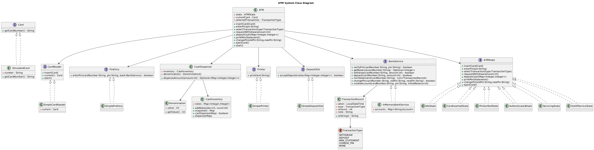

# ATM System - Low Level Design Implementation

## Overview

This project implements a comprehensive ATM (Automated Teller Machine) system following low-level design principles and design patterns. The system demonstrates proper object-oriented design with clean separation of concerns, state management, and modular architecture.

## Class Diagram



## Architecture & Design Patterns

### 1. State Pattern
The ATM system uses the **State Pattern** to manage different operational states:
- **IdleState**: Initial state, waiting for card insertion
- **CardInsertedState**: Card inserted, waiting for PIN entry
- **PinVerifiedState**: PIN verified, ready for transaction selection
- **AuthenticatedState**: User authenticated, can perform transactions
- **ServicingState**: Currently processing a transaction
- **OutOfServiceState**: ATM is out of service

### 2. Strategy Pattern
Different implementations for hardware components:
- `CardReader` interface with `SimpleCardReader` implementation
- `PinEntry` interface with `SimplePinEntry` implementation
- `Printer` interface with `SimplePrinter` implementation
- `DepositSlot` interface with `SimpleDepositSlot` implementation

### 3. Dependency Injection
The `ATM` class receives all its dependencies through constructor injection, making it testable and loosely coupled.

## Core Components

### ATM Class
The main controller that orchestrates all ATM operations:
- Manages state transitions
- Coordinates between hardware components
- Handles user interactions

### Hardware Components
- **CardReader**: Handles card insertion and ejection
- **PinEntry**: Manages PIN input and verification
- **CashDispenser**: Dispenses cash using optimal denomination algorithm
- **Printer**: Prints receipts and statements
- **DepositSlot**: Handles cash deposits

### Banking Services
- **BankService**: Interface for banking operations
- **InMemoryBankService**: In-memory implementation for demonstration
- **TransactionRecord**: Records transaction history

### Cash Management
- **CashInventory**: Manages available denominations and quantities
- **Denomination**: Represents currency denominations
- **CashDispenser**: Implements cash dispensing logic with optimal denomination selection

## Features

### Transaction Types
1. **Cash Withdrawal**
   - Validates sufficient balance
   - Optimal denomination dispensing
   - Updates account balance
   - Prints transaction receipt

2. **Cash Deposit**
   - Accepts multiple denominations
   - Updates account balance
   - Records transaction

3. **Mini Statement**
   - Displays recent transaction history
   - Shows current balance

4. **PIN Change**
   - Secure PIN modification
   - Validates old PIN before change

### Security Features
- PIN verification through banking service
- Secure card handling
- Transaction logging
- Balance validation before withdrawal

### Cash Dispensing Algorithm
The system implements an intelligent cash dispensing algorithm:
- Uses largest denominations first
- Validates availability before dispensing
- Handles insufficient denomination scenarios
- Maintains cash inventory integrity

## Project Structure

```
ATM/
├── ATM.java                    # Main ATM controller
├── ATMState.java               # State interface
├── AuthenticatedState.java     # Authenticated user state
├── BankService.java            # Banking service interface
├── Card.java                   # Card interface
├── CardInsertedState.java      # Card inserted state
├── CardReader.java             # Card reader interface
├── CashDispenser.java          # Cash dispensing logic
├── CashInventory.java          # Cash inventory management
├── Denomination.java           # Currency denomination
├── DepositSlot.java            # Deposit slot interface
├── IdleState.java              # Initial idle state
├── InMemoryBankService.java    # In-memory bank implementation
├── Main.java                   # Application entry point
├── OutOfServiceState.java      # Out of service state
├── PinEntry.java               # PIN entry interface
├── PinVerifiedState.java       # PIN verified state
├── Printer.java                # Printer interface
├── ServicingState.java         # Transaction processing state
├── SimpleCardReader.java       # Card reader implementation
├── SimpleDepositSlot.java      # Deposit slot implementation
├── SimplePinEntry.java         # PIN entry implementation
├── SimplePrinter.java          # Printer implementation
├── SimulatedCard.java          # Card implementation
├── TransactionRecord.java      # Transaction record model
└── TransactionType.java        # Transaction type enum
```

## How to Run

### Prerequisites
- Java 8 or higher
- Basic understanding of Java and OOP concepts

### Compilation
```bash
javac -d . *.java
```

### Execution
```bash
java atm.Main
```

## Sample Usage

The `Main.java` demonstrates complete ATM usage:

```java
// Initialize ATM with hardware components and bank service
ATM atm = new ATM(cardReader, pinEntry, dispenser, printer, depositSlot, bank);

// Start ATM
atm.start();

// User operations
atm.insertCard(card);
atm.enterPin("1234");
atm.selectTransaction(TransactionType.WITHDRAW);
atm.requestWithdraw(3700);
atm.printMiniStatement();
atm.changePin("1234", "4321");
atm.ejectCard();
```

## Key Design Decisions

### 1. State Management
- **Why State Pattern**: ATM behavior varies significantly based on current state
- **Benefits**: Clean state transitions, easy to add new states, clear business logic separation

### 2. Component Abstraction
- **Why Interfaces**: Hardware components can have different implementations
- **Benefits**: Easy testing with mock implementations, flexibility for hardware changes

### 3. Cash Dispensing Strategy
- **Algorithm**: Greedy approach using largest denominations first
- **Validation**: Ensures sufficient inventory before committing to dispensing
- **Benefits**: Optimal use of available denominations, prevents partial dispensing failures

### 4. Banking Service Abstraction
- **Why Interface**: Separates ATM logic from banking operations
- **Benefits**: Can integrate with real banking systems, easy testing with mock services

## Transaction Flow

### Withdrawal Flow
1. **IdleState** → Insert card → **CardInsertedState**
2. **CardInsertedState** → Enter PIN → **PinVerifiedState**
3. **PinVerifiedState** → Select transaction → **AuthenticatedState**
4. **AuthenticatedState** → Request amount → **ServicingState**
5. **ServicingState** → Process withdrawal → **AuthenticatedState**
6. **AuthenticatedState** → Eject card → **IdleState**

### Deposit Flow
1. Follow steps 1-3 from withdrawal
2. **AuthenticatedState** → Deposit cash → **ServicingState**
3. **ServicingState** → Process deposit → **AuthenticatedState**
4. **AuthenticatedState** → Continue or eject → **IdleState**

## Error Handling

- **Insufficient Balance**: Validates account balance before withdrawal
- **Insufficient Cash**: Checks ATM cash inventory
- **Invalid PIN**: Handles incorrect PIN entries
- **Card Issues**: Manages card insertion/ejection errors
- **State Violations**: Prevents invalid operations in wrong states

## Learning Outcomes

This implementation demonstrates:
- **SOLID Principles**: Single responsibility, open/closed, dependency inversion
- **Design Patterns**: State, Strategy, Dependency Injection
- **Clean Code**: Readable, maintainable, and extensible code
- **Error Handling**: Robust error management
- **Business Logic**: Real-world ATM operations modeling

